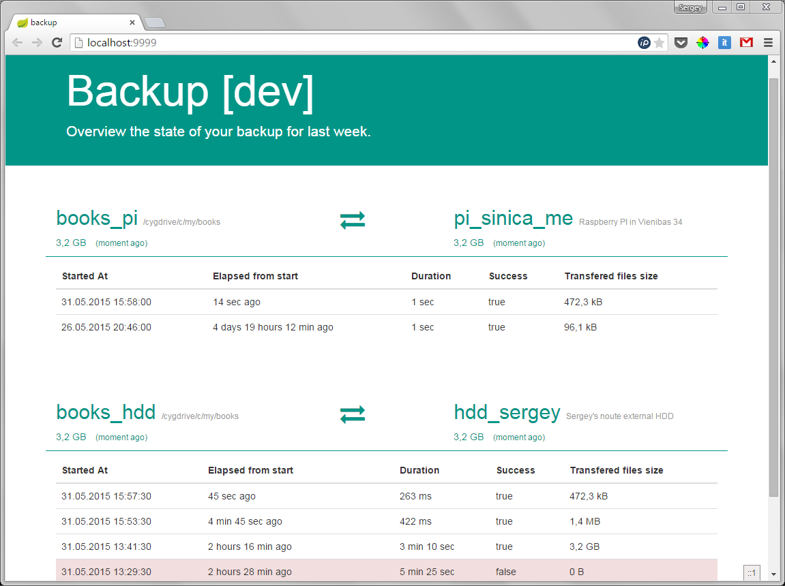

image:https://badges.gitter.im/Join%20Chat.svg[link="https://gitter.im/ssinica/backup?utm_source=badge&utm_medium=badge&utm_campaign=pr-badge&utm_content=badge"]

# Backup

WARNING: Being too busy to worry about backup is like being too busy driving a car to put on a seatbelt.

## Terminology ##

bc-destination:: The location where the files are copied. Can be: `SSH`, `LOCAL`, `S3`, etc...
bc-node:: Utility which resides on client computer. `bc-node` backups data to `bc-destination`.

## TOC ##

* link:docs/release-notes.adoc[Release notes]
* link:docs/mount-usb-drive.adoc[How to mount USB drive (Debian)]
* link:docs/setup-ssh-bc-destination.adoc[How to setup SSH bc-destination]
* link:docs/releasing-guide.adoc[How to release]

## Screenshots ##

## Description ##

The app uses `rsync` to periodically backup directories on your computer to different hard drives or to remote hosts thru SSH connections. 

The backup is incremental - only changed files are copied. Also the backup configuration is very flexible. Each directory can be backuped to multiple destinations. And for each backup task you can specify different backup schedule using CRON expression. So, for example, you can backup your books collection to external HDD each hour and to remote SSH host each day.

App runs in background but there is an icon in system tray, which changes each time backup is running. 

Also the app has a web UI, which can be launch from a system tray. A web UI lists all the backup tasks with some historical information about each task. For example, it shows information about few last backups: when it was triggered, how many data were transferred, how long it took, etc.... 

You can trigger ad-hoc backup tasks from web UI.

In addition, the app can notify you about different events thru XMPP (other channels are comming...).

## Installation ##

* Download ZIP distribution from link:https://github.com/ssinica/backup/releases/latest[latest release];
* Unpack to any location;
* Create `application.yml` file in `config` directory (see link:bc-distro/config/application-example.yml[application-example.yml] as reference);
* Setup link:docs/setup-ssh-bc-destination.adoc[SSH bc-destination];
* Run `start-gui.cmd`.

## Configuration ##

See link:bc-distro/config/application-example.yml[application-example.yml] for configuration options.

The main idea:

* Each `bc-node` has uniq `Application Id`. This ID is used in folder layout on bc-destinations. Also in future this ID might be used in bc-master to identify backup clients.
* Configuration contains a list of bc-destinations. Currently `SSH` and `LOCAL` destinations are supported.
* Configuration contains a list of backup items. For each backup item you should specify `Destination ID` and link:http://docs.spring.io/spring/docs/current/javadoc-api/org/springframework/scheduling/support/CronSequenceGenerator.html[CRON] expression.

## Building ##

* Ensure `JAVA_HOME` env variable points to JDK8
* See `x-build.cmd` as an example build script. Essentially that it does is simple:
+
----
mvn clean install
----

## Running from IDE ##

* Main class: `synitex.backup.Application`
* VM options:
** `-Djava.awt.headless=false`, for GUI mode
** `-Djava.awt.headless=true`, for CLI mode
* Program arguments: `--spring.profiles.active=dev`. To load configuration file from `./bc-node/config/application-dev.yml`.
+
You can copy example configuration file `./bc-distro/config/application-example.yml` to `./bc-node/config/application-dev.yml`.
* Working directory: `{project.path}\bc-node`

## Misc links ##

* http://docs.spring.io/spring-boot/docs/current/reference/html/boot-features-developing-web-applications.html
* https://angularjs.org/
* http://www.thymeleaf.org/doc/articles/springmvcaccessdata.html
* http://www.thymeleaf.org/doc/tutorials/2.1/usingthymeleaf.html
